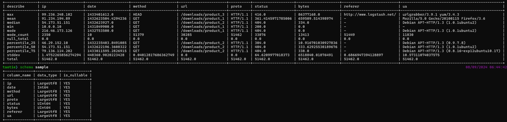

#第十三周作业：
通过在E:\07-taotie-7-7-describe-rewrite\nginx>路径下cargo run生成nginx_logs.parquet, 将其放入assets文件夹(本作业已将生成文件放入assets), 
通过运行E:\07-taotie-7-7-describe-rewrite connect assets/nginx_logs.parquet -n nginx 回车， describe nginx 回车可以看到统计信息， Date转换成了timestamp便于统计,增加了众数统计(mode)以及众数个数(mode-count)统计
具体内容如下图所示：
